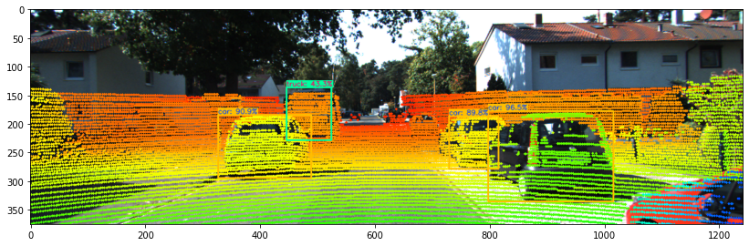
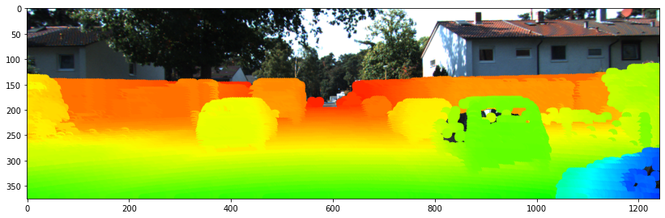

 Point-Pixel Fusion for Object Detection and Depth Estimation

	

### Contents
- Proposed Architecture
- ROI Matching
- Object Detection with Depth Infomration
- Demo

## Proposed Architecture

## ROI Matching

## Depth Map

## Object Detection with Depth Infomration

## Demo

